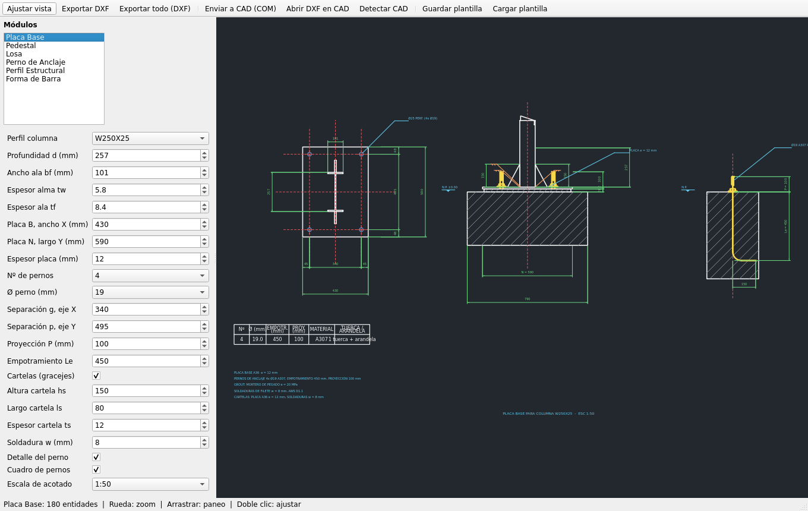
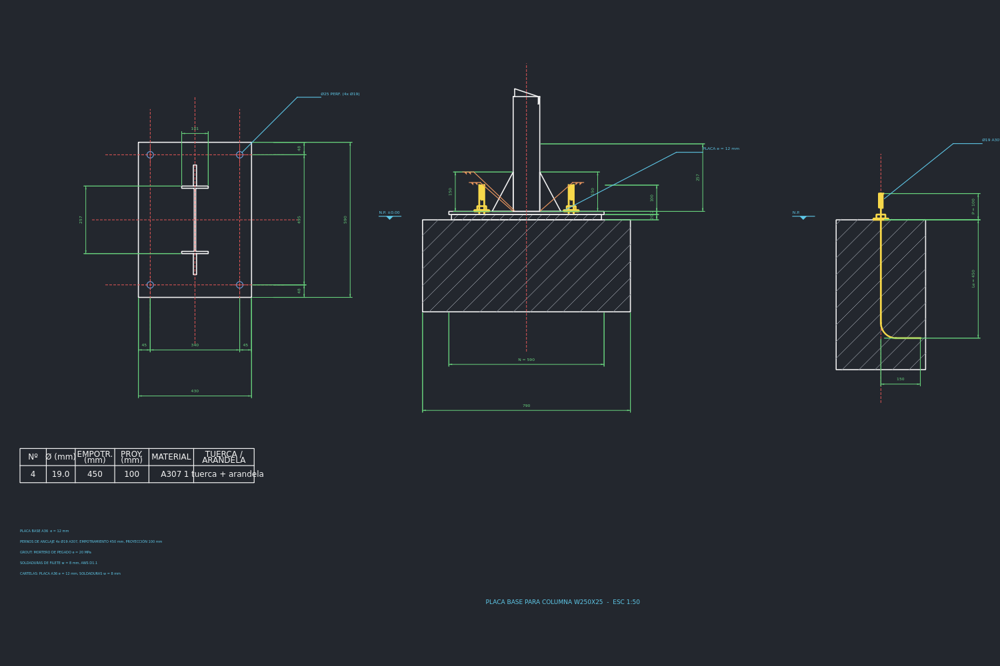
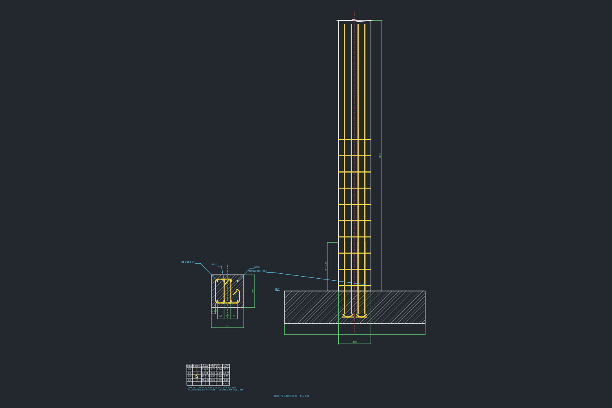
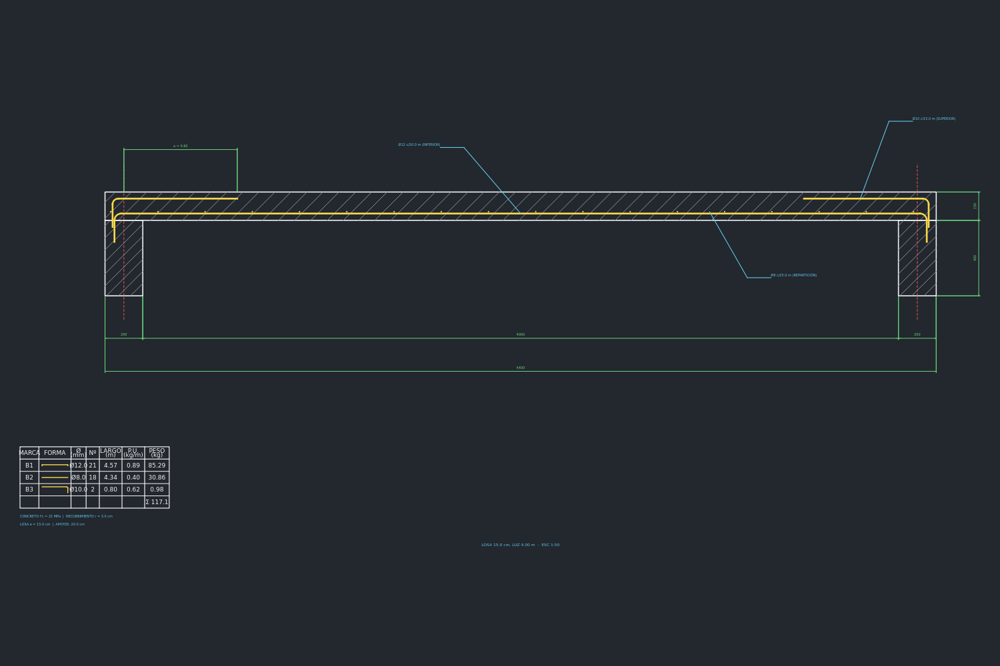
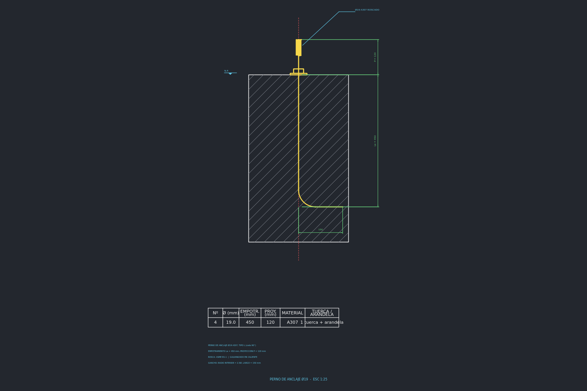

# StructGen CAD

Generador automático de dibujos estructurales en formato **DXF**, compatible
con **AutoCAD** y **ZWCAD**, escrito en **Python + PySide6**.

La aplicación incluye una serie de funciones y formas comunes de ingeniería
estructural —dibujo y acotado de **pernos**, **placas base**, **pedestales**
y su **armadura**, **losas**— además del **armado rápido** de perfiles y
formas de barra, con cuadros de despiece y de pernos generados
automáticamente.



---

## 1. Instalación

Requisitos: **Python 3.9 o superior**.

```bash
pip install -r requirements.txt
python main.py
```

Dependencias:
- `PySide6` — interfaz gráfica.
- `ezdxf` — escritura de archivos DXF (R2010, sin necesidad de CAD abierto).
- `pywin32` — (opcional, Windows) conexión COM en vivo con AutoCAD/ZWCAD.

## 2. Uso general

1. Seleccione un **módulo** en la lista lateral (Placa Base, Pedestal, Losa,
   Perno de Anclaje, Perfil Estructural, Forma de Barra).
2. Edite los **parámetros** del formulario: la vista previa 2D se actualiza
   en vivo.
3. **Exportar DXF…** (`Ctrl+E`) genera el archivo listo para abrir en
   AutoCAD o ZWCAD. **Exportar todo (DXF)** lotea los seis módulos a una
   carpeta.
4. **Guardar/Cargar plantilla** almacena los parámetros del módulo en JSON
   para reutilizar configuraciones típicas.

En la vista previa: **rueda** = zoom, **arrastrar** = paneo,
**doble clic** = ajustar a la ventana.

### Conexión COM en vivo (AutoCAD / ZWCAD abiertos)

Además del archivo DXF, la aplicación puede **dibujar directamente en el
CAD que esté abierto** en ese momento, sin archivos intermedios:

| Botón | Función |
|-------|---------|
| **Enviar a CAD (COM)** (`Ctrl+G`) | Crea el detalle entidad por entidad en el espacio modelo del documento activo: capas, cotas asociativas nativas, textos, sólidos y polilíneas. Luego regenera y hace zoom extensión. |
| **Abrir DXF en CAD** | Exporta un DXF temporal y lo abre como documento en el CAD activo (útil para conservar el archivo). |
| **Detectar CAD** | Prueba la conexión y muestra programa, versión y documento activo. |

Requisitos y notas:
- Solo **Windows**, con `pip install pywin32` (incluido en requirements).
- El CAD debe estar **abierto antes de enviar**; la conexión usa
  `GetActiveObject` sobre el ROT de COM.
- Programas soportados: **AutoCAD**, **ZWCAD** (API COM idéntica) y
  **BricsCAD**; en ZWCAD se usa el ProgID `ZWCAD.Application`.
- Si el CAD se ejecuta como administrador, Python debe ejecutarse con el
  mismo nivel de privilegios para que el ROT exponga la sesión.
- Las cotas se crean con `AddDimRotated` (nativas y editables en el CAD);
  las variables `DIMTXT/DIMASZ/DIMEXE/DIMEXO/DIMGAP/DIMTAD…` se ajustan al
  estilo de acotado del módulo.
- Sin pywin32 o sin CAD abierto, la app muestra un aviso claro y todo lo
  demás sigue funcionando (la ruta DXF no depende de COM).

### Escala de acotado

El dibujo se genera a escala 1:1 en milímetros. El parámetro *Escala de
acotado* (1:10 … 1:100) multiplica la altura de textos, cotas y símbolos
para que al imprimir la hoja midan lo correcto (texto base 3 mm en papel).
La geometría no cambia.

## 3. Módulos

| Módulo | Genera |
|--------|--------|
| **Placa Base** | Planta (placa, perforaciones, pernos, ejes) + elevación (columna W, grout, cartelas, soldaduras, N.P.) + detalle del perno + cuadro de pernos. Acotado en dos niveles. Los perfiles W y dimensiones de placa se auto-sugieren. |
| **Pedestal** | Sección transversal con barras longitudinales, estribo cerrado con ganchos a 135°, tirantes, hachurado y recubrimiento + elevación con arranques ganchados en zapata + cuadro de despiece con pesos. |
| **Losa** | Sección transversal con armadura inferior ganchada en apoyos, repartición, armadura superior opcional, hachurado, acotado y despiece. |
| **Perno de Anclaje** | Detalle de perno tipo L (codo 90°), J (gancho 135°) o recto con placa de anclaje: rosca, tuerca, arandela, concreto, N.P. y cuadro de pernos. |
| **Perfil Estructural** | Secciones I/W, H (HEA), canal C, ángulo L, T y caja HSS con acotado completo, ejes y propiedades aproximadas (área y peso lineal). Series comerciales W/HE precargadas. |
| **Forma de Barra** | Barras recta, L 90°, U, estribo cerrado 135° y Z, con radios de doblez reales (R = k·Ø), desarrollo calculado y fila de despiece. |

## 4. Lo que se genera en el DXF

- **Capas normalizadas** con colores y grosores: `EJE` (rojo, CENTER),
  `CONCRETO`, `ACERO` (amarillo, grueso), `ACOTADO` (verde), `TEXTOS`
  (cian), `PERFORACIONES` (azul), `SOLDADURA`, `HACHURADO`, `TABLAS`,
  `OCULTO` (HIDDEN).
- **Cotas asociativas nativas** (entidades `DIMENSION`) con estilo
  paramétrico: se pueden editar desde el CAD.
- **Texto** en estilo SHX estándar (`txt.shx`), disponible en AutoCAD y
  ZWCAD.
- **Cuadros de despiece** con marca, forma (boceto), diámetro, cantidad,
  largo de desarrollo, peso unitario (d²/162) y peso total.
- Unidades del documento: milímetros (`$INSUNITS = 4`).

### Ejemplos generados

| | |
|---|---|
|  |  |
|  |  |

Los archivos `samples/*.dxf` son salidas de ejemplo de cada módulo; ábralos
directamente en AutoCAD o ZWCAD para verificar.

## 5. Arquitectura del código

```
StructGenCAD/
├── main.py                  Punto de entrada
├── core/
│   ├── ir.py                Representación intermedia (entidades del dibujo)
│   ├── geom.py              Hachurado, barras dobladas (poly_bar), símbolos
│   ├── dims.py              Acotado con niveles (cadenas + totales)
│   └── tables.py            Cuadros de despiece y de pernos
├── cad/
│   ├── dxf_out.py           IR -> DXF R2010 (ezdxf)
│   └── com_live.py          IR -> sesión CAD abierta (COM/ActiveX en vivo)
├── generators/
│   ├── data.py              Bases de datos de perfiles, diámetros, escalas
│   ├── panels.py            Formularios declarativos (SPEC) de PySide6
│   ├── base_plate.py        Placa base
│   ├── pedestal.py          Pedestal
│   ├── slab.py              Losa
│   ├── anchor_bolt.py       Perno de anclaje
│   ├── profile.py           Perfiles estructurales
│   └── bar_shape.py         Formas de barra
├── app/
│   ├── main_window.py       Ventana principal
│   └── preview.py           Vista previa 2D (QPainter, zoom/pan)
└── samples/                 DXF y PNG de ejemplo de cada módulo
```

Punto clave del diseño: la **vista previa, el DXF y la conexión COM en vivo
consumen la misma representación intermedia**. Cada generador construye un
`Drawing` (líneas, arcos, polilíneas, cotas, tablas, líderes) que el visor
pinta con QPainter, `cad/dxf_out.py` traduce a entidades DXF y
`cad/com_live.py` recrea entidad por entidad en el CAD abierto vía COM —
lo que ve es exactamente lo que se exporta.

Para **agregar un módulo nuevo**: cree un archivo en `generators/` con una
clase `SpecPanel` (SPEC declarativo) y una función `builder(params) ->
Drawing`, y regístrelo en `generators/__init__.py`.

## 6. Notas de cálculo incluidas

- Peso de barra corrugada: `d²/162` kg/m.
- Desarrollo de barras dobladas: suma de tramos rectos + arcos al radio de
  línea central (R interior + Ø/2).
- Ganchos de estribo a 135° con largo `6Ø ≥ 75 mm`; radios de doblez de
  barra `k·Ø` (k configurable, 4 por defecto).
- Perforaciones de placa sobredimensionadas `Ø + 6 mm`.
- Propiedades de perfiles sin radios de unión (aproximadas).

## 7. Generar ejecutable (.exe)

El repositorio incluye un workflow de GitHub Actions
(`.github/workflows/build-exe.yml`) que compila un `.exe` de Windows con
PyInstaller. Es de disparo **manual**:

1. En GitHub, ir a la pestaña **Actions** → **Build Windows EXE**.
2. Click en **Run workflow** (opcionalmente indicar una etiqueta de
   versión).
3. Al finalizar, descargar el artefacto `StructGenCAD-windows-exe` desde
   la ejecución del workflow.

Para compilarlo localmente en Windows:

```bash
pip install -r requirements.txt
pip install pyinstaller
pyinstaller --noconfirm --clean --onefile --windowed --name StructGenCAD main.py
```

El ejecutable queda en `dist/StructGenCAD.exe`.

## 8. Extensiones posibles

- Plantillas de cajetín (rúbrica) y marco.
- Más perfiles (HP, cañas, angulares dobles), placas de espera y conexiones
  empernadas/soldadas.
- Exportación directa a DWG mediante ODA File Converter.
